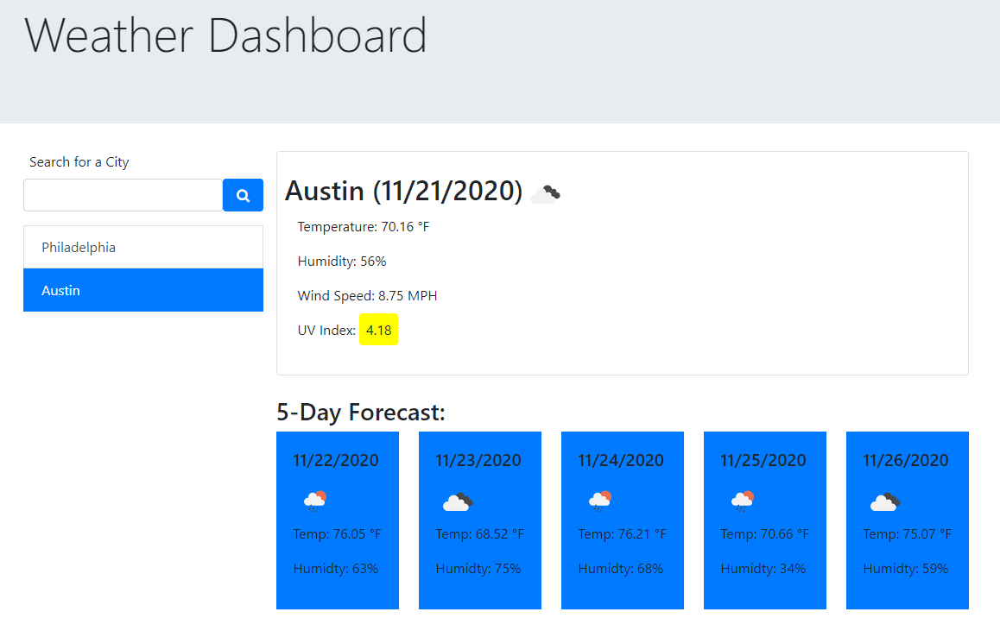

# Title: #06-Weather-Dashboard-Dan-Aument-UT-Homework

## Table of Contents:
* [Description](#Description)
* [Screenshot](#Screenshot)
* [Location of Deployed Project](#Location)
* [Notes from Dan](#Notes)
* [Credits](#Credits)
* [License](#License)

### <a name="Description">Description:</a>
This project serves as a homework assignment submission for the sixth week of UT's web dev coding bootcamp.  It contains a codebase and a deployed webpage for a weather dashboard web app.

### <a name="Screenshot">Screenshot: </a>

### <a name="Location">Location of Deployed Project:</a>
https://danaument.github.io/weather-dashboard/

### <a name="Notes">Notes from Dan:  </a>

I mostly enjoyed completing this assignment.  I learned a lot about AJAX and jQuery that we did not cover in our class sessions, such as how to use .then() and .catch() to work within the asynchronous nature of AJAX.  Most of the issues I had with this project were related to handling edge cases.  

I have a number of additional features that I would like to add at a later point, including buttons to remove individual cities from the search history, more sophisticated CSS styling, and an autocomplete feature for the search query using the Google places API.  

### <a name="Credits">Credits: </a>
This project was completed by Dan Aument using code and assets provided by The Coding Boot Camp at UT Austin in partnership with Trilogy Education Services. I adapted some code from https://flaviocopes.com/how-to-uppercase-first-letter-javascript/ to ~text-transform: capitalize~ my search input string in JavaScript.

### <a name="License">License: </a>

Distributed under the MIT License

MIT License

Copyright (c) 2020 Daniel Aument

Permission is hereby granted, free of charge, to any person obtaining a copy
of this software and associated documentation files (the "Software"), to deal
in the Software without restriction, including without limitation the rights
to use, copy, modify, merge, publish, distribute, sublicense, and/or sell
copies of the Software, and to permit persons to whom the Software is
furnished to do so, subject to the following conditions:

The above copyright notice and this permission notice shall be included in all
copies or substantial portions of the Software.

THE SOFTWARE IS PROVIDED "AS IS", WITHOUT WARRANTY OF ANY KIND, EXPRESS OR
IMPLIED, INCLUDING BUT NOT LIMITED TO THE WARRANTIES OF MERCHANTABILITY,
FITNESS FOR A PARTICULAR PURPOSE AND NONINFRINGEMENT. IN NO EVENT SHALL THE
AUTHORS OR COPYRIGHT HOLDERS BE LIABLE FOR ANY CLAIM, DAMAGES OR OTHER
LIABILITY, WHETHER IN AN ACTION OF CONTRACT, TORT OR OTHERWISE, ARISING FROM,
OUT OF OR IN CONNECTION WITH THE SOFTWARE OR THE USE OR OTHER DEALINGS IN THE
SOFTWARE.